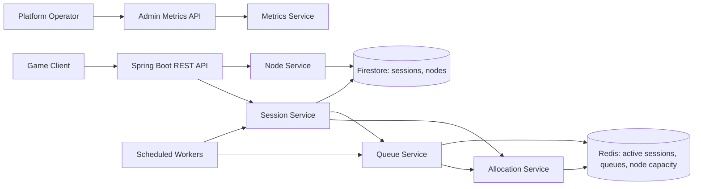

# Cloud Game Session Service

Backend session orchestration service for a cloud gaming platform. It models the layer that accepts launch requests, allocates users to GPU nodes, queues requests when capacity is full, tracks active sessions through heartbeats, expires stale sessions, and exposes operator metrics.

## Architecture



The application can run in two modes:

- `APP_STORE_TYPE=redis` uses Redis for active session TTLs, region queues, and atomic node capacity reservation.
- `APP_PERSISTENCE_TYPE=firestore` uses Firebase Firestore for persistent session and GPU node metadata.

For fast local development and tests, both default to `memory`. `docker-compose.yml` runs Redis-backed state and memory persistence so the API is usable without Firebase credentials.

## Requirements

- Java 21+
- Docker, for Redis/Testcontainers/Docker Compose flows
- Firebase service account JSON, only when using Firestore persistence

The included `./mvnw` bootstraps Maven into `.mvn/` if Maven is not installed.

## Run Locally

```bash
./mvnw test
./mvnw spring-boot:run
```

Run with Redis:

```bash
docker compose up --build
```

The service listens on `http://localhost:8080`.

## Firestore Configuration

Set these environment variables when running with Firestore:

```bash
export APP_PERSISTENCE_TYPE=firestore
export FIREBASE_PROJECT_ID=your-project-id
export FIREBASE_SERVICE_ACCOUNT_JSON='{"type":"service_account", ... }'
```

Alternatively, omit `FIREBASE_SERVICE_ACCOUNT_JSON` and use `GOOGLE_APPLICATION_CREDENTIALS` for Application Default Credentials.

## API

### Register GPU Node

```bash
curl -X POST http://localhost:8080/api/v1/nodes \
  -H 'Content-Type: application/json' \
  -d '{"nodeId":"gpu-node-usw-1","region":"us-west","maxSessions":1}'
```

### Request Session

```bash
curl -X POST http://localhost:8080/api/v1/sessions \
  -H 'Content-Type: application/json' \
  -d '{"userId":"user_123","gameId":"cyberpunk-2077","region":"us-west"}'
```

Active response:

```json
{
  "sessionId": "sess_abc123",
  "status": "ACTIVE",
  "nodeId": "gpu-node-usw-1",
  "queuePosition": null
}
```

Queued response:

```json
{
  "sessionId": "sess_def456",
  "status": "QUEUED",
  "nodeId": null,
  "queuePosition": 1
}
```

### Get Session

```bash
curl http://localhost:8080/api/v1/sessions/{sessionId}
```

### Heartbeat

```bash
curl -X POST http://localhost:8080/api/v1/sessions/{sessionId}/heartbeat
```

### Terminate Session

```bash
curl -X DELETE http://localhost:8080/api/v1/sessions/{sessionId}
```

Terminating an active session releases GPU capacity and immediately attempts to promote the next queued session in the same region.

### List Nodes

```bash
curl http://localhost:8080/api/v1/nodes
```

### Admin Metrics

```bash
curl http://localhost:8080/api/v1/admin/metrics \
  -H 'X-Internal-Api-Key: dev-admin-key'
```

With Docker Compose, the key is `local-admin-key`.

## Session Lifecycle

Valid transitions:

```text
QUEUED -> ALLOCATING
ALLOCATING -> ACTIVE
ACTIVE -> TERMINATED
ACTIVE -> EXPIRED
QUEUED -> TERMINATED
ALLOCATING -> FAILED
FAILED -> QUEUED
```

The stale-session worker expires active sessions whose `lastHeartbeatAt` is older than `APP_HEARTBEAT_TIMEOUT`. The queue-draining worker periodically checks region queues and allocates waiting sessions when capacity opens.

## Kubernetes

Example manifests live in `k8s/`:

- `deployment.yml` with readiness/liveness probes
- `service.yml`
- `configmap.yml`
- `secret.example.yml`
- `hpa.yml`

Apply after publishing an image and creating a real secret:

```bash
kubectl apply -f k8s/
```

## Tests

```bash
./mvnw test
```

Coverage includes:

- allocation without overbooking
- queued session promotion after termination
- heartbeat timestamp refresh
- stale session expiration and queue draining
- Redis FIFO queue and atomic capacity reservation through Testcontainers when Docker is available
